# PDM Loan Management System

A comprehensive loan management platform built with modern technologies, featuring a Next.js frontend and Spring Boot backend with MySQL database.

**Course:** Principles of Database Management (S1_2025-26_G01) — Team #1 — HCMIU VNU

## Overview

The PDM Loan Management System is a full-stack web application designed to streamline loan application processing, verification, risk assessment, and loan lifecycle management. The system supports multiple user roles (Applicants, Bankers, Verifiers, Underwriters) with role-based access control and comprehensive workflow management.

## Features

- **User Authentication & Authorization**: JWT-based authentication with role-based access control
- **Loan Application Management**: Complete loan application workflow from submission to disbursement
- **Document Management**: Upload, verify, and manage loan-related documents
- **KYC/AML Verification**: Integrated identity verification and anti-money laundering checks
- **Risk Assessment**: Automated risk scoring and assessment for loan applications
- **Offer Generation**: Dynamic loan offer generation with customizable terms
- **Contract Management**: Digital contract creation and e-signature support
- **Disbursement Processing**: Loan disbursement tracking and processing
- **Repayment Scheduling**: Automated repayment schedule generation and management
- **Wallet & Transactions**: Built-in wallet system for deposits and withdrawals
- **Support Tickets**: Customer support ticket management
- **Notifications**: Real-time notification system for user alerts
- **Messaging System**: Internal messaging between users and staff

## Screenshots

### Public Pages

#### Landing Page
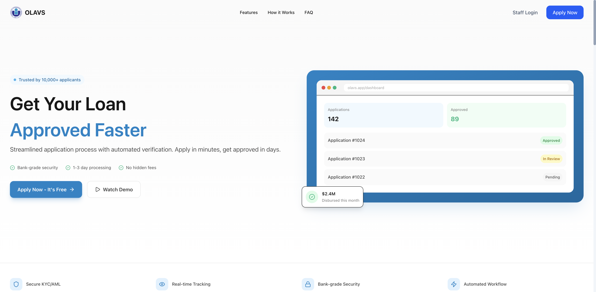

#### User Login
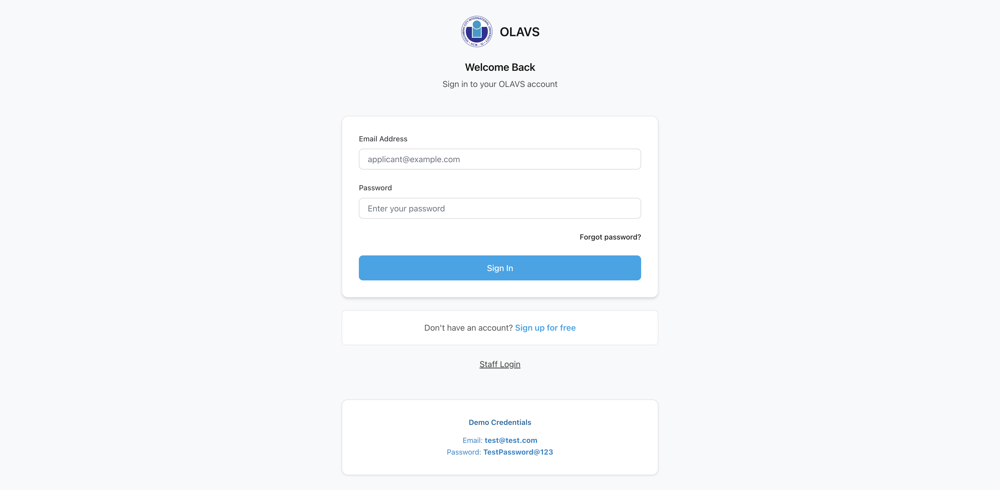

#### Staff Portal Login
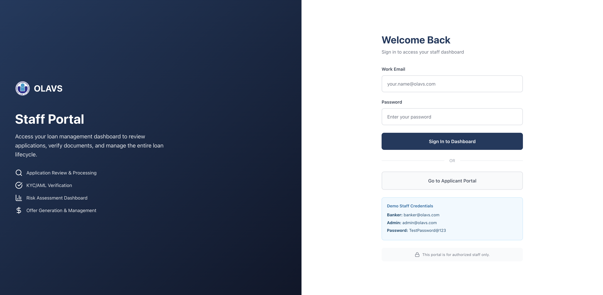

### User Dashboard (Applicant)

#### Dashboard Overview
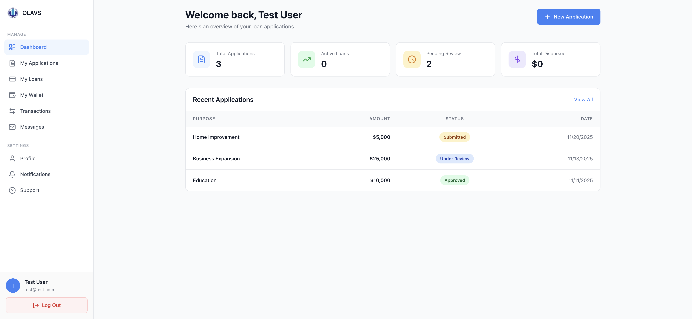

#### My Applications
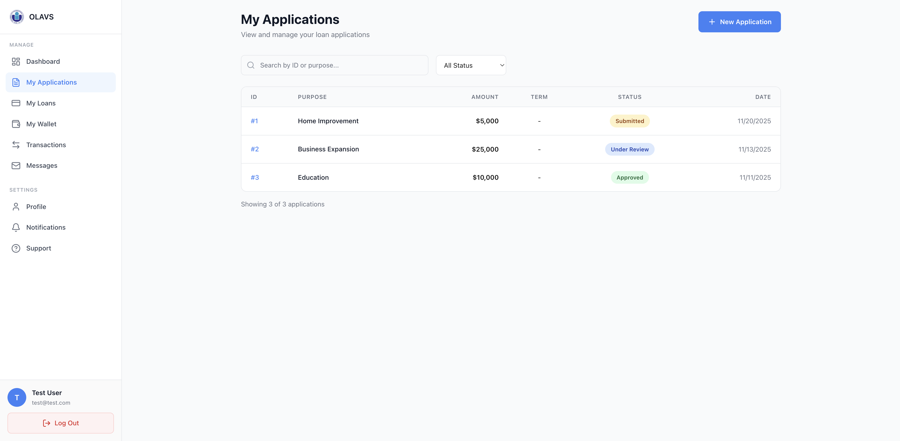

#### New Loan Application
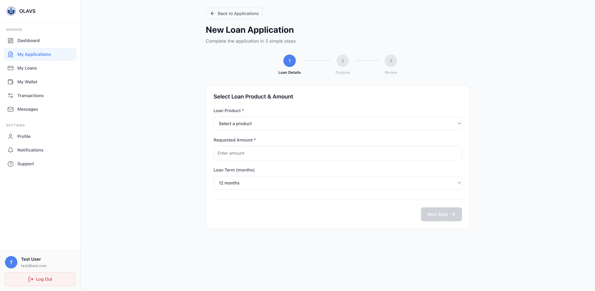

#### My Loans
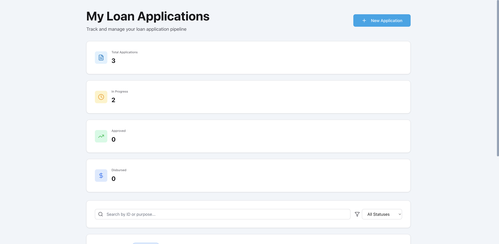

#### My Wallet
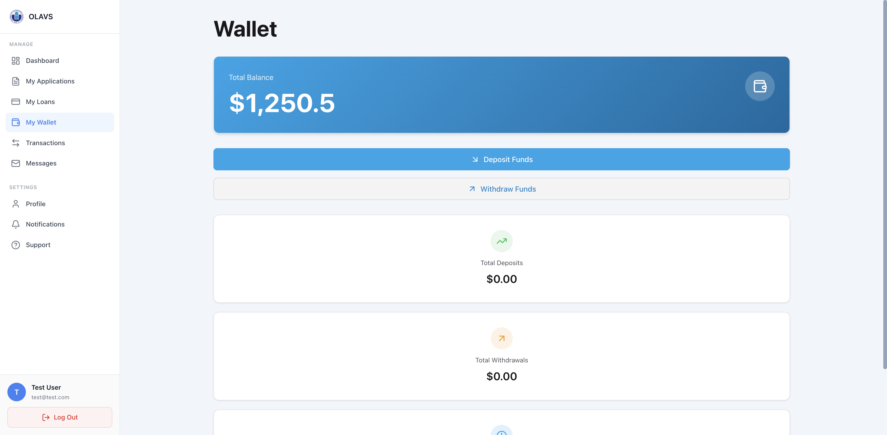

#### Transactions
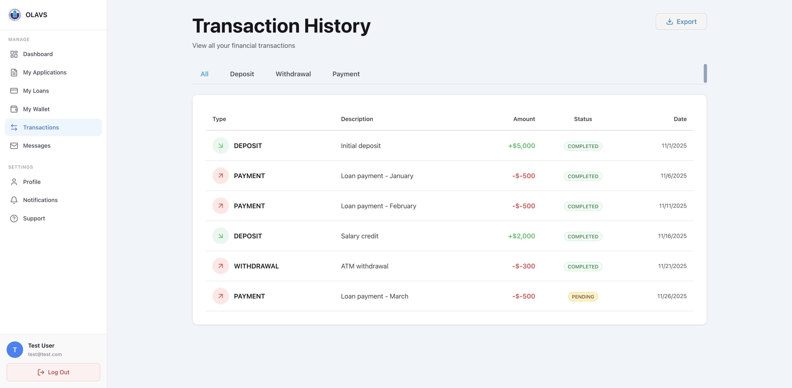

#### Support Center
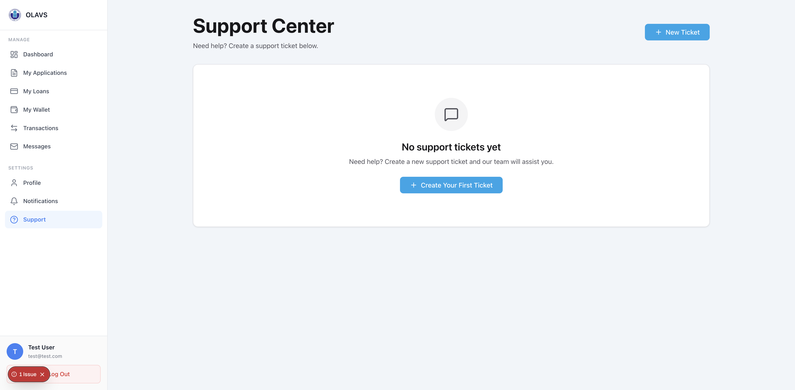

### Staff & Admin Dashboards

#### Admin Dashboard
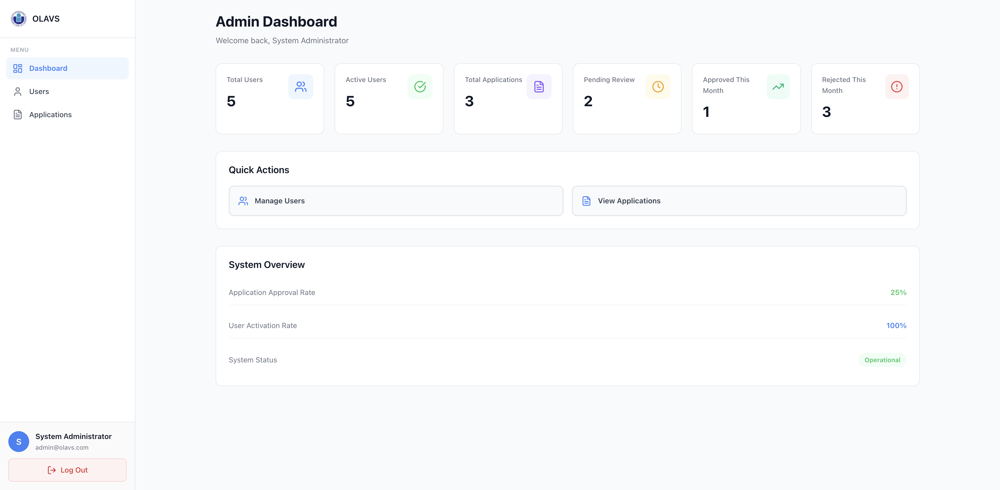

## Tech Stack

### Frontend
- **Framework**: Next.js 16 (App Router)
- **Language**: TypeScript 5
- **Styling**: Tailwind CSS 4
- **UI Components**: Lucide React icons
- **Runtime**: React 19

### Backend
- **Framework**: Spring Boot 3.x
- **Language**: Java 17+
- **Build Tool**: Maven 3.8+
- **Security**: Spring Security with JWT
- **Database**: MySQL 8.0
- **ORM**: Spring Data JPA

### Infrastructure
- **Database**: MySQL 8.0 (database name: `olavs_db`)
- **Port Configuration**:
  - Frontend: `4000`
  - Backend: `8080` (API at `/api`)
  - Database: `3306`

## Architecture

```
┌─────────────────────────────────────────────────────────────┐
│                        Client Layer                          │
│  Next.js Frontend (Port 4000) - TypeScript + Tailwind CSS   │
└────────────────────┬────────────────────────────────────────┘
                     │ HTTP/REST API
                     │
┌────────────────────┴────────────────────────────────────────┐
│                      Application Layer                       │
│    Spring Boot Backend (Port 8080) - Java 17 + Maven        │
│                                                              │
│  ┌──────────────┐  ┌──────────────┐  ┌──────────────┐     │
│  │ Controllers  │  │   Services   │  │   Security   │     │
│  │  (REST API)  │─▶│ (Business    │◀─│ (JWT + RBAC) │     │
│  │              │  │   Logic)     │  │              │     │
│  └──────────────┘  └──────────────┘  └──────────────┘     │
│                           │                                 │
│                    ┌──────┴──────┐                         │
│                    │  Repository  │                         │
│                    │    Layer     │                         │
│                    └──────┬──────┘                         │
└───────────────────────────┼────────────────────────────────┘
                            │ JDBC
                            │
┌───────────────────────────┴────────────────────────────────┐
│                      Data Layer                             │
│         MySQL Database (Port 3306) - olavs_db               │
│                                                              │
│  Users │ Applications │ Documents │ Offers │ Contracts     │
│  Loans │ Repayments │ Transactions │ Wallets │ Tickets     │
└─────────────────────────────────────────────────────────────┘
```

## Quick Start

### Prerequisites
- **Node.js**: 20.x or higher
- **Java**: 17 or higher
- **Maven**: 3.8 or higher
- **MySQL**: 8.0 or higher

### 1. Clone the Repository
```bash
git clone <repository-url>
cd PDM_Project
```

### 2. Set Up Environment Variables

**Backend (.env)**:
```bash
cd pdm-backend
cp .env.example .env
# Edit .env with your database credentials and JWT secret
```

**Frontend (.env.local)**:
```bash
cd pdm-frontend
cp .env.example .env.local
# Default values work for local development
```

### 3. Start the Application

**Option A: Use Start Scripts**
```bash
# Start both backend and frontend
./start-all.sh

# Or start individually
./start-backend.sh  # Backend on http://localhost:8080
./start-frontend.sh # Frontend on http://localhost:4000
```

**Option B: Manual Start**

Start Backend:
```bash
cd pdm-backend
mvn spring-boot:run
```

Start Frontend:
```bash
cd pdm-frontend
npm install
npm run dev
```

### 4. Access the Application
- **Frontend**: http://localhost:4000
- **Backend API**: http://localhost:8080/api
- **API Health Check**: http://localhost:8080/api/auth/health

## Environment Variables

### Frontend (`pdm-frontend/.env.local`)
| Variable | Description | Default |
|----------|-------------|---------|
| `NEXT_PUBLIC_API_URL` | Backend API base URL | `http://localhost:8080/api` |

### Backend (`pdm-backend/.env`)
| Variable | Description | Required |
|----------|-------------|----------|
| `DB_URL` | MySQL JDBC connection string | Yes |
| `DB_USERNAME` | Database username | Yes |
| `DB_PASSWORD` | Database password | Yes |
| `JWT_SECRET` | Secret key for JWT token generation | Yes |

See [SECRET_MANAGEMENT.md](./docs/SECRET_MANAGEMENT.md) for detailed security configuration.

## Documentation

- **[Frontend README](./pdm-frontend/README.md)** - Frontend-specific documentation
- **[Backend README](./pdm-backend/README.md)** - Backend-specific documentation
- **[API Documentation](./docs/api/)** - API endpoints and usage
- **[Security Guide](./docs/SECRET_MANAGEMENT.md)** - Security best practices
- **[Testing Guide](./docs/TESTING_GUIDE.md)** - Testing strategies and instructions
- **[Quick Start Guide](./docs/QUICK_START.md)** - Detailed setup instructions
- **[Audit Reports](./docs/audit-reports/)** - Security and code quality audits

## Project Structure

```
PDM_Project/
├── pdm-frontend/           # Next.js frontend application
│   ├── app/                # Next.js app router pages
│   ├── components/         # Reusable React components
│   ├── lib/                # Utility functions and helpers
│   ├── contexts/           # React context providers
│   └── package.json
├── pdm-backend/            # Spring Boot backend application
│   ├── src/main/java/      # Java source code
│   │   ├── config/         # Configuration classes
│   │   ├── security/       # Security components
│   │   ├── web/            # REST controllers
│   │   ├── service/        # Business logic
│   │   ├── domain/         # JPA entities
│   │   └── dto/            # Data Transfer Objects
│   ├── src/main/resources/ # Application resources
│   └── pom.xml
├── database/               # Database scripts and migrations
│   ├── schema-extended.sql # Production schema (16 entities)
│   ├── data-extended.sql   # Production seed data
│   └── init-database.sh    # Database initialization script
├── context/                # Project context files
│   ├── FEATURES.txt        # Feature implementation status
│   ├── DONE.txt            # Completed features
│   ├── NEXT.txt            # Next steps and priorities
│   └── DESIGN_SYSTEM.txt   # OLAVS design system reference
├── docs/                   # Project documentation
│   ├── audit-reports/      # Security and quality audits
│   ├── guides/             # Setup and development guides
│   ├── api/                # API documentation
│   └── reports/            # Implementation reports
├── start-all.sh            # Start both frontend and backend
├── start-backend.sh        # Start backend only
├── start-frontend.sh       # Start frontend only
├── stop-all.sh             # Stop all services
└── README.md               # This file
```

## API Endpoints

The system provides 75+ REST API endpoints organized into the following categories:

- **Authentication**: `/api/auth/*` - User registration, login, and session management
- **Applications**: `/api/v2/applications/*` - Loan application lifecycle
- **Documents**: `/api/v2/documents/*` - Document upload and verification
- **Verifications**: `/api/v2/verifications/*` - KYC/AML verification
- **Risk Assessments**: `/api/v2/risk-assessments/*` - Risk scoring
- **Offers**: `/api/v2/offers/*` - Loan offer generation and acceptance
- **Contracts**: `/api/v2/contracts/*` - Contract creation and signing
- **Disbursements**: `/api/v2/disbursements/*` - Loan disbursement processing
- **Repayments**: `/api/v2/repayments/*` - Repayment schedule and payments
- **Users**: `/api/users/*` - User management
- **Wallets**: `/api/wallets/*` - Wallet operations
- **Transactions**: `/api/transactions/*` - Transaction history
- **Tickets**: `/api/tickets/*` - Support ticket management
- **Notifications**: `/api/notifications/*` - User notifications
- **Messages**: `/api/messages/*` - Internal messaging

For detailed API documentation, see [QUICK_START.md](./docs/QUICK_START.md).

## Development

### Running Tests
```bash
# Backend tests
cd pdm-backend
mvn test

# Frontend tests
cd pdm-frontend
npm test
```

### Building for Production
```bash
# Backend
cd pdm-backend
mvn clean package

# Frontend
cd pdm-frontend
npm run build
```

### Code Quality
- Backend: Spring Boot best practices, Java 17 features
- Frontend: TypeScript strict mode, ESLint configuration
- Security: JWT authentication, password hashing, SQL injection prevention
- Testing: Unit tests, integration tests, API endpoint testing

## Contributing

We welcome contributions! Please see [CONTRIBUTING.md](./CONTRIBUTING.md) for guidelines on:
- Code of conduct
- Development workflow
- Pull request process
- Coding standards
- Testing requirements

## Security

Security is a top priority. This project implements:
- JWT-based authentication with secure token management
- Role-based access control (RBAC)
- Password hashing with BCrypt
- SQL injection prevention via JPA/parameterized queries
- CORS configuration
- Environment variable-based secret management
- Security audit compliance

To report security vulnerabilities, please create a private security advisory on GitHub.

## License

This project is for **educational and demonstration purposes**.
You are free to use, modify, and extend it with proper credit.

## Support

- **Documentation**: See the `/docs` directory
- **Issues**: Create an issue on GitHub
- **Support Tickets**: Use the in-app support ticket system

## Project Status

- **Current Version**: 1.0.0
- **Status**: ~90% Complete (MVP Ready)
- **Last Updated**: December 2025

### Completion Summary
| Component | Status |
|-----------|--------|
| Database Schema | 100% (16 entities, 15 ENUMs, triggers, procedures) |
| Backend Services | 100% (75+ REST endpoints) |
| Frontend Design System | 100% (OLAVS complete) |
| Frontend Pages | 95% (all major routes implemented) |
| Authentication & Security | 100% (JWT + RBAC) |
| Testing | 20% (needs expansion) |
| Deployment | Ready for staging |

## Team Members

| # | Student ID  | Student Name           | Phone      | Role          |
|---|-------------|------------------------|------------|---------------|
| 1 | ITCSIU23054 | Dao Huu Hoai           | 0344612654 | Full-stack    |
| 2 | ITITWE23014 | Le Thanh Danh (Leader) | 0767178267 | Full-stack    |
| 3 | ITDSIU24022 | Vo Quang Khai          | 0363681624 | Report Writer |
| 4 | ITITWE23030 | Phan Minh Khanh        | 0902628125 | ERD Designer  |
| 5 | ITDSIU23027 | Tran Chau Thanh Tuan   | 0788286494 | Report Writer |
| 6 | ITCSIU24063 | Vu Duc Nhan            | 0937840446 | Backend       |
| 7 | ITITDK23037 | Le Hoang Quoc Anh      | 0354503153 | Frontend      |
| 8 | ITCSIU24090 | Truong Minh Tri        | 0708941111 | Frontend      |
| 9 | ITCSIU24059 | Hoang Trieu Nam        | 0769315790 | Report Writer |
| 10| ITCSIU24045 | Vo Tri Khoi            | 0869250015 | Backend       |
| 11| ITITWE23941 | Vo Nguyen Dinh Bao     | 0858010878 | ERD Designer  |

## Acknowledgments

- Spring Boot team for the excellent framework
- Next.js team for the React framework
- Tailwind CSS for the utility-first styling
- HCMIU for academic support

---

**Getting Started**: Follow the [Quick Start](#quick-start) guide above to run the application locally in under 5 minutes.

**Need Help?**: Check the [documentation](./docs/) or create an issue.
