# OLAVS Loan Management System - Team Presentation

## Team Members & Roles
| Name | Primary Role | Cross-functional Contributions |
|------|-------------|-------------------------------|
| Le Thanh Danh | Leader, Full-stack Developer | Architecture, Code Review, Integration |
| Dao Huu Hoai | Full-stack Developer | API + UI Integration, Testing |
| Vu Duc Nhan | Backend Developer | API Development, Security |
| Vo Tri Khoi | Backend Developer | Database Logic, Performance |
| Le Hoang Quoc Anh | Frontend Developer | User Interface, UX Design |
| Truong Minh Tri | Frontend Developer | Staff Interface, Components |
| Phan Minh Khanh | ERD Designer | Data Modeling, Schema Design |
| Vo Nguyen Dinh Bao | ERD Designer | Relationships, Normalization |
| Vo Quang Khai | Report Writer | Documentation, User Guides |
| Tran Chau Thanh Tuan | Report Writer | Technical Docs, API Docs |
| Hoang Trieu Nam | Report Writer | Testing Reports, Deployment Docs |

---

# SLIDE 1: OPENING SLIDE

## OLAVS - Online Loan Application & Verification System

**A Comprehensive Digital Loan Management Platform**

```
   ____  _        _  __     _______
  / __ \| |      / \\ \   / / ____|
 | |  | | |     / _ \\ \ / /| (___
 | |  | | |    / ___ \\ V /  \___ \
 | |__| | |___/ ___ \ | |   ____) |
  \____/|_____/_/   \_\|_|  |_____/
```

**Team PDM Project**
- 11 Members | 5 Roles | 1 Vision

**Presented by: Le Thanh Danh (Team Leader)**

### SCRIPT - Le Thanh Danh (Opening):
> "Good morning/afternoon everyone. I'm Le Thanh Danh, the team leader and full-stack developer for this project. Today, we're excited to present OLAVS - our Online Loan Application and Verification System.
>
> OLAVS is a comprehensive digital platform that transforms the traditional loan application process into a seamless, transparent, and efficient digital experience. Our team of 11 members worked collaboratively across 5 key roles to bring this vision to life.
>
> Throughout this presentation, each team member will share their contributions and how we worked together as a unified team. No one worked in isolation - every feature you'll see today is the result of cross-functional collaboration.
>
> Let me now introduce our system architecture before passing to my colleagues."

---

# SLIDE 2: SYSTEM ARCHITECTURE OVERVIEW

## System Architecture & Technology Stack

**Presented by: Le Thanh Danh (Leader, Full-stack Developer)**

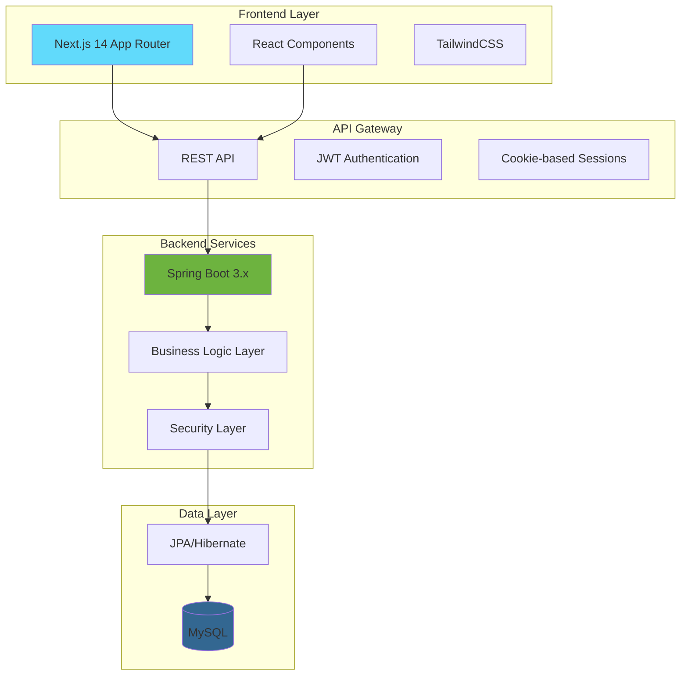

### Technology Stack

| Layer | Technology | Purpose |
|-------|------------|---------|
| Frontend | Next.js 14, React, TailwindCSS | Modern, responsive UI |
| Backend | Spring Boot 3.x, Java 17 | Robust business logic |
| Database | MySQL | Reliable data persistence |
| Auth | JWT + HttpOnly Cookies | Secure authentication |
| API | RESTful + OpenAPI | Standard communication |

### SCRIPT - Le Thanh Danh (Architecture):
> "As the technical lead, I designed our system architecture with scalability and maintainability in mind.
>
> We use a three-tier architecture: Next.js 14 for our frontend providing server-side rendering and excellent performance, Spring Boot 3 for our robust backend handling complex business logic, and MySQL for reliable data persistence.
>
> Security was paramount - I worked closely with Nhan on implementing JWT authentication with HttpOnly cookies to prevent XSS attacks. I also collaborated with our ERD designers, Khanh and Bao, to ensure our data models properly reflect business requirements.
>
> My role extended beyond coding - I conducted code reviews for both frontend and backend teams, resolved integration conflicts, and ensured consistent coding standards across the project.
>
> Now let me pass to Hoai, who will explain how we integrated all these components together."

---

# SLIDE 3: FULL-STACK INTEGRATION

## Seamless Frontend-Backend Integration

**Presented by: Dao Huu Hoai (Full-stack Developer)**

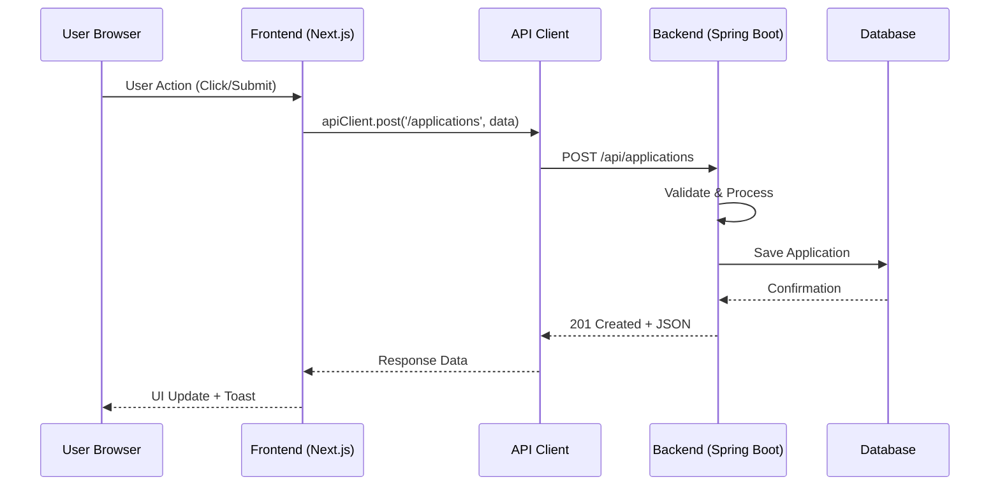

### API Client Architecture

```typescript
// Centralized API Client Pattern
const apiClient = {
  get: async <T>(endpoint: string): Promise<T> => {
    const response = await fetch(`${API_URL}${endpoint}`, {
      credentials: 'include', // HttpOnly cookies
      headers: { 'Content-Type': 'application/json' }
    });
    return response.json();
  },
  post: async <T>(endpoint: string, data: any): Promise<T> => {
    // ... implementation
  }
};
```

### Cross-functional Contributions

| Collaborated With | Contribution |
|-------------------|--------------|
| Quoc Anh & Tri | API integration patterns, error handling |
| Nhan & Khoi | API contract definitions, response formats |
| Khanh & Bao | Data transfer objects alignment |
| Danh | Code review, architecture decisions |

### SCRIPT - Dao Huu Hoai:
> "I'm Hoai, the other full-stack developer on our team. My primary responsibility was bridging the gap between frontend and backend.
>
> As you can see in this sequence diagram, I designed our API client architecture that all frontend components use. This centralized approach ensures consistent error handling, authentication, and request formatting across the entire application.
>
> I worked extensively with both teams. With Quoc Anh and Tri on the frontend, I established patterns for data fetching, caching, and optimistic updates. With Nhan and Khoi on the backend, I defined our API contracts and response formats.
>
> One critical contribution was implementing the authentication flow. I coordinated with Nhan on the backend JWT implementation while ensuring the frontend correctly handles token refresh and session management.
>
> I also contributed to testing - writing integration tests that verify the entire request-response cycle works correctly. This helped our report writers, especially Nam, document our test coverage accurately.
>
> Next, Quoc Anh will show you the user-facing interfaces we built together."

---

# SLIDE 4: FRONTEND - USER EXPERIENCE FLOW

## User Application Journey

**Presented by: Le Hoang Quoc Anh (Frontend Developer)**

### User Flow Diagram

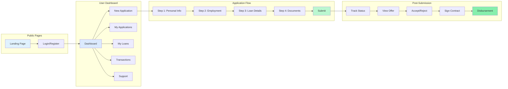

### [VIDEO PLACEHOLDER: User Journey Demo]

```
+----------------------------------------------------------+
|                                                          |
|    VIDEO: User Application Journey (2-3 minutes)         |
|                                                          |
|    Content Required:                                     |
|    1. Landing page tour (0:00 - 0:20)                    |
|       - Hero section, features, CTA buttons              |
|       - Responsive design showcase                       |
|                                                          |
|    2. Registration & Login (0:20 - 0:45)                 |
|       - New user registration form                       |
|       - Login with demo credentials                      |
|       - Auth state change (navbar update)                |
|                                                          |
|    3. Dashboard Overview (0:45 - 1:15)                   |
|       - Stats cards, recent activities                   |
|       - Navigation sidebar                               |
|       - Quick actions                                    |
|                                                          |
|    4. New Application (1:15 - 2:15)                      |
|       - Multi-step form wizard                           |
|       - Form validation in action                        |
|       - Document upload simulation                       |
|       - Submission confirmation                          |
|                                                          |
|    5. Application Tracking (2:15 - 2:45)                 |
|       - Status timeline                                  |
|       - Offer review page                                |
|       - Contract signing                                 |
|                                                          |
|    Recording Notes:                                      |
|    - Use 1920x1080 resolution                            |
|    - Highlight cursor movements                          |
|    - Add zoom effects on important elements              |
|    - Include soft background music                       |
|                                                          |
+----------------------------------------------------------+
```

### Key UI Components Built

| Component | Description | Collaboration |
|-----------|-------------|---------------|
| OlavsButton | Primary action buttons | Design system with Tri |
| OlavsCard | Container components | Shared with Tri |
| OlavsInput | Form inputs with validation | Validation logic from Hoai |
| UserDashboardLayout | Main layout wrapper | API integration with Hoai |
| ApplicationWizard | Multi-step form | Backend DTOs from Nhan |

### SCRIPT - Le Hoang Quoc Anh:
> "Hi everyone, I'm Quoc Anh, and I led the development of our user-facing interfaces.
>
> This flow diagram shows the complete user journey in OLAVS. From the moment a user lands on our homepage to when they receive their loan disbursement, we've designed every step for clarity and ease of use.
>
> [Play video] As you can see in this demo, users experience a seamless journey. The landing page immediately communicates our value proposition. Registration is simple with real-time validation - this validation logic was actually implemented with help from Hoai who ensured it matches our backend rules.
>
> The dashboard gives users a complete overview of their financial activities. I designed this with insights from our report writers, especially Khai, who helped me understand what information users need most prominently.
>
> The application wizard was a major collaboration. Tri helped me build the reusable form components, Nhan provided the exact data structure we needed to match the backend, and Khanh's ERD diagrams helped me understand the relationships between different form sections.
>
> Now Tri will show you the staff side of our application."

---

# SLIDE 5: FRONTEND - STAFF INTERFACE

## Staff Portal & Workflow

**Presented by: Truong Minh Tri (Frontend Developer)**

### Staff Flow Diagram

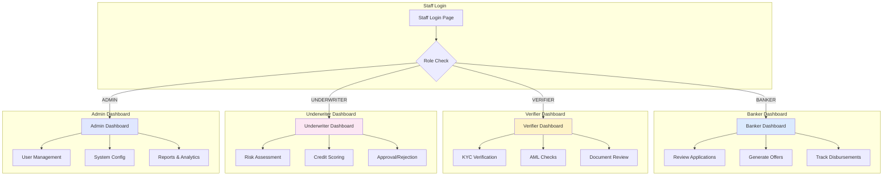

### [VIDEO PLACEHOLDER: Staff Workflow Demo]

```
+----------------------------------------------------------+
|                                                          |
|    VIDEO: Staff Workflow Demo (2-3 minutes)              |
|                                                          |
|    Content Required:                                     |
|    1. Staff Login (0:00 - 0:20)                          |
|       - Separate staff login portal                      |
|       - Role-based redirect                              |
|                                                          |
|    2. Banker Workflow (0:20 - 1:00)                      |
|       - Application queue                                |
|       - Detailed application review                      |
|       - Offer generation interface                       |
|       - Approval workflow                                |
|                                                          |
|    3. Verifier Workflow (1:00 - 1:40)                    |
|       - Verification queue                               |
|       - KYC document verification                        |
|       - AML check interface                              |
|       - Approval/Flag actions                            |
|                                                          |
|    4. Underwriter Workflow (1:40 - 2:20)                 |
|       - Risk assessment dashboard                        |
|       - Credit score visualization                       |
|       - Decision making interface                        |
|                                                          |
|    5. Admin Panel (2:20 - 2:50)                          |
|       - User management                                  |
|       - System statistics                                |
|       - Configuration options                            |
|                                                          |
|    Recording Notes:                                      |
|    - Show role-specific color schemes                    |
|    - Demonstrate status transitions                      |
|    - Show real-time updates if possible                  |
|                                                          |
+----------------------------------------------------------+
```

### Role-Based Component Architecture

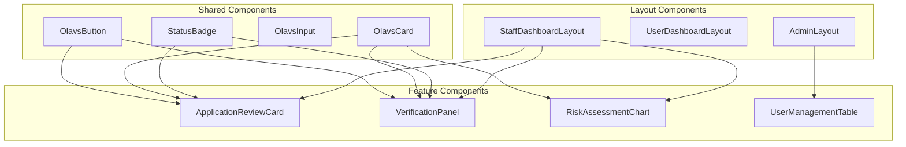

### SCRIPT - Truong Minh Tri:
> "I'm Tri, and I focused on building the staff-side interfaces for OLAVS.
>
> Our staff portal serves four distinct roles: Bankers, Verifiers, Underwriters, and Administrators. Each role has a customized dashboard tailored to their specific workflows.
>
> [Play video] The banker sees their application queue with filtering and sorting options. The verifier gets a specialized KYC/AML verification interface with document preview capabilities. The underwriter has risk assessment tools with visual credit scoring. And the admin has complete control over system configuration.
>
> What's important to note is the component reusability. Quoc Anh and I built a shared design system - the OlavsButton, OlavsCard, and other base components work identically across user and staff interfaces. This consistency was intentional and makes maintenance much easier.
>
> I worked closely with Khoi on the backend to understand the verification workflow states. Bao's entity relationship diagrams helped me understand how staff actions affect the application lifecycle. And Tuan helped document our component API for future developers.
>
> Now, Nhan will dive into the backend architecture that powers all these interfaces."

---

# SLIDE 6: BACKEND - USE CASE DIAGRAM

## System Use Cases & Actor Interactions

**Presented by: Vu Duc Nhan (Backend Developer)**

### Use Case Diagram

```mermaid
graph TB
    subgraph "Actors"
        A((Applicant))
        B((Banker))
        C((Verifier))
        D((Underwriter))
        E((Admin))
    end

    subgraph "Authentication"
        UC1[Register Account]
        UC2[Login/Logout]
        UC3[Reset Password]
    end

    subgraph "Application Management"
        UC4[Submit Application]
        UC5[Upload Documents]
        UC6[Track Application Status]
        UC7[View/Accept Offer]
        UC8[Sign Contract]
    end

    subgraph "Staff Operations"
        UC9[Review Application]
        UC10[Verify KYC/AML]
        UC11[Assess Risk]
        UC12[Generate Offer]
        UC13[Process Disbursement]
    end

    subgraph "Administration"
        UC14[Manage Users]
        UC15[Configure Products]
        UC16[View Reports]
        UC17[System Settings]
    end

    A --> UC1
    A --> UC2
    A --> UC4
    A --> UC5
    A --> UC6
    A --> UC7
    A --> UC8

    B --> UC2
    B --> UC9
    B --> UC12
    B --> UC13

    C --> UC2
    C --> UC10

    D --> UC2
    D --> UC11
    D --> UC12

    E --> UC2
    E --> UC14
    E --> UC15
    E --> UC16
    E --> UC17
```

### API Endpoints Structure

| Module | Endpoints | Methods |
|--------|-----------|---------|
| Auth | `/api/auth/*` | POST (login, register, logout) |
| Applications | `/api/applications/*` | GET, POST, PUT |
| Verifications | `/api/verifications/*` | GET, POST, PUT |
| Offers | `/api/offers/*` | GET, POST, PUT |
| Contracts | `/api/contracts/*` | GET, POST |
| Users | `/api/users/*` | GET, POST, PUT, DELETE |

### Security Implementation

```java
// JWT + Cookie-based Authentication
@Configuration
public class SecurityConfig {
    @Bean
    public SecurityFilterChain filterChain(HttpSecurity http) {
        return http
            .cors(cors -> cors.configurationSource(corsConfig()))
            .csrf(csrf -> csrf.disable())
            .authorizeHttpRequests(auth -> auth
                .requestMatchers("/api/auth/**").permitAll()
                .requestMatchers("/api/admin/**").hasRole("ADMIN")
                .requestMatchers("/api/staff/**").hasAnyRole("BANKER", "VERIFIER", "UNDERWRITER")
                .anyRequest().authenticated()
            )
            .addFilterBefore(jwtFilter, UsernamePasswordAuthFilter.class)
            .build();
    }
}
```

### SCRIPT - Vu Duc Nhan:
> "I'm Nhan, one of the backend developers. I focused on security, authentication, and the core API infrastructure.
>
> This use case diagram shows all the interactions in our system. We have five actor types, each with specific permissions. The beauty of our design is that permissions are enforced at multiple levels - route guards on the frontend that Hoai implemented, and security filters on the backend.
>
> My key contributions include:
> - The complete authentication system with JWT tokens stored in HttpOnly cookies
> - Role-based access control that Danh helped me architect
> - API security headers and CORS configuration
> - Input validation and sanitization
>
> I collaborated extensively with the ERD team. Khanh and Bao designed the user and role tables, and I implemented the JPA entities and repositories to match their specifications. When they updated the schema, we had regular sync meetings to ensure my code reflected the changes.
>
> For the frontend team, I created detailed API documentation that Tuan helped format professionally. This documentation became the contract that Quoc Anh and Tri used to build their interfaces.
>
> Now Khoi will explain the data flow and business logic layer."

---

# SLIDE 7: BACKEND - DATA FLOW & BUSINESS LOGIC

## Application Lifecycle & Data Flow

**Presented by: Vo Tri Khoi (Backend Developer)**

### Application State Machine

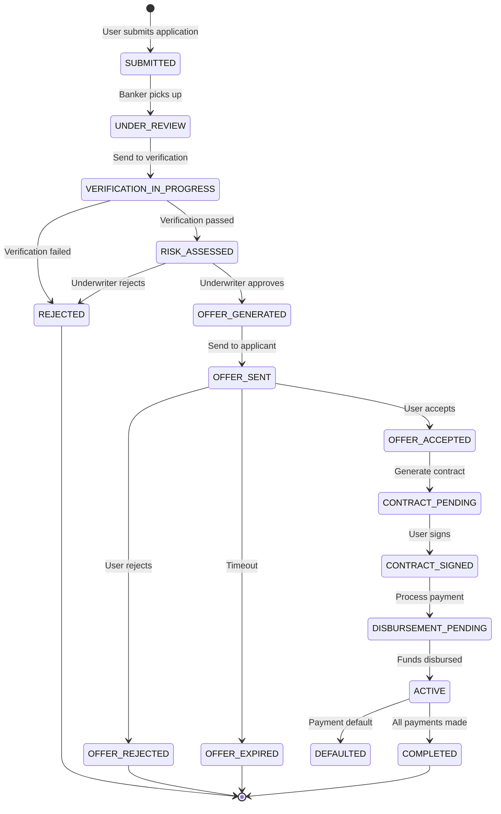

### Data Flow Diagram

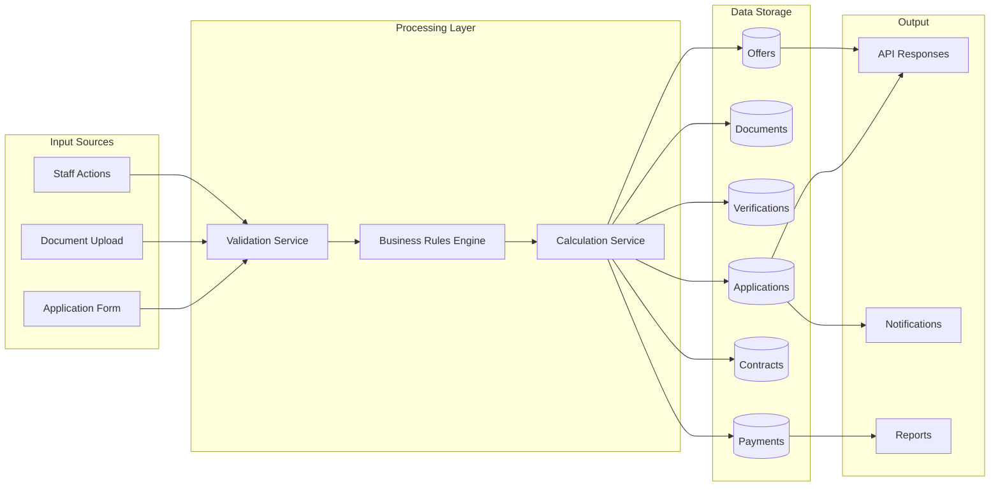

### Service Layer Architecture

```java
// Example: Application Service with Business Logic
@Service
@Transactional
public class ApplicationService {

    public Application submitApplication(ApplicationDTO dto) {
        // 1. Validate input
        validateApplicationData(dto);

        // 2. Check applicant eligibility
        checkApplicantEligibility(dto.getApplicantId());

        // 3. Calculate preliminary assessment
        PreliminaryAssessment assessment = calculateAssessment(dto);

        // 4. Create application entity
        Application app = applicationMapper.toEntity(dto);
        app.setStatus(ApplicationStatus.SUBMITTED);
        app.setPreliminaryScore(assessment.getScore());

        // 5. Save and trigger workflow
        Application saved = applicationRepository.save(app);
        workflowService.initiate(saved);
        notificationService.notifyNewApplication(saved);

        return saved;
    }
}
```

### SCRIPT - Vo Tri Khoi:
> "Hi, I'm Khoi, the other backend developer. While Nhan focused on security, I concentrated on business logic and data flow.
>
> This state diagram represents the heart of our system - the application lifecycle. An application goes through multiple states, from SUBMITTED to either COMPLETED, REJECTED, or DEFAULTED. Each transition is triggered by specific actions and validated by our business rules.
>
> I implemented the service layer that orchestrates all these transitions. For example, when a banker reviews an application, my code validates that the application is in the correct state, the banker has permission, and all required verifications are complete.
>
> The calculation service was a joint effort. I worked with Bao to understand the loan calculation formulas - interest rates, EMI calculations, risk scoring. He provided the mathematical models, and I translated them into code.
>
> For performance, I implemented caching strategies for frequently accessed data and optimized our database queries. Danh reviewed these optimizations, and Khai helped document the performance improvements in our technical report.
>
> The notification system triggers emails and in-app notifications at each state transition. Hoai integrated these notifications into the frontend to show real-time updates.
>
> Now Khanh will present our data model design."

---

# SLIDE 8: ERD DESIGN - CORE ENTITIES

## Entity Relationship Design - Core Tables

**Presented by: Phan Minh Khanh (ERD Designer)**

### Core Entity Relationship Diagram

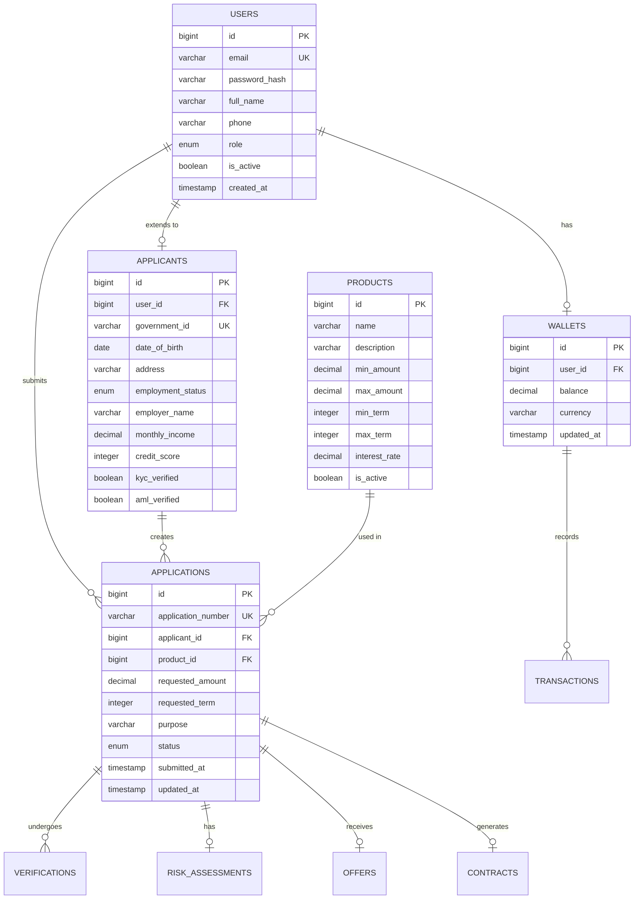

### Database Schema Statistics

| Category | Count | Description |
|----------|-------|-------------|
| Total Tables | 15 | Core system tables |
| Relationships | 23 | Foreign key constraints |
| Indexes | 18 | Performance optimization |
| Enums | 8 | Status and type fields |

### SCRIPT - Phan Minh Khanh:
> "I'm Khanh, one of the ERD designers. Together with Bao, I designed the database schema that powers OLAVS.
>
> This diagram shows our core entities. The USERS table is central - it connects to APPLICANTS for extended profile information, to WALLETS for financial transactions, and through APPLICANTS to APPLICATIONS.
>
> Our design philosophy was normalization with practical denormalization where needed. For example, we store calculated fields like credit_score in APPLICANTS because recalculating it for every query would be expensive.
>
> I worked closely with Nhan to ensure the JPA entities correctly map to these tables. When he needed specific query patterns, I added indexes. When Khoi needed better performance for the application listing, I created composite indexes on status and created_at.
>
> For the frontend team, I created a simplified view of the schema so they could understand what data was available. Quoc Anh used this to design form fields that match our database constraints - like maximum lengths and required fields.
>
> Our report writers, especially Tuan, helped document the data dictionary - explaining what each field means and its valid values.
>
> Now Bao will show the extended relationships and financial entities."

---

# SLIDE 9: ERD DESIGN - EXTENDED ENTITIES

## Entity Relationship Design - Verification & Financial

**Presented by: Vo Nguyen Dinh Bao (ERD Designer)**

### Verification & Financial ERD

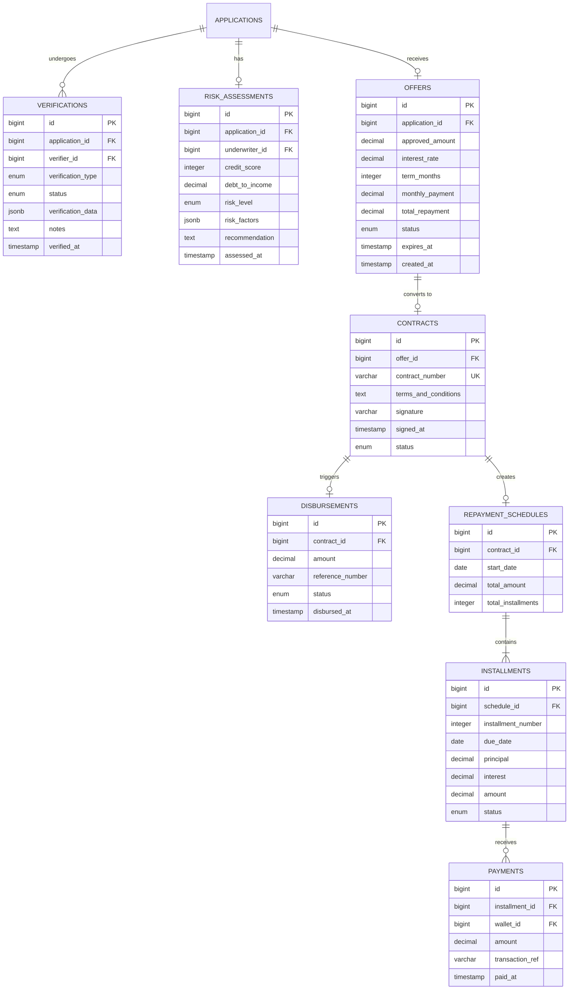

### Financial Calculation Models

```sql
-- EMI Calculation (Equated Monthly Installment)
-- EMI = P × r × (1+r)^n / ((1+r)^n - 1)
-- Where: P = Principal, r = monthly interest rate, n = number of months

CREATE OR REPLACE FUNCTION calculate_emi(
    principal DECIMAL,
    annual_rate DECIMAL,
    term_months INTEGER
) RETURNS DECIMAL AS $$
DECLARE
    monthly_rate DECIMAL;
    emi DECIMAL;
BEGIN
    monthly_rate := annual_rate / 12 / 100;
    emi := principal * monthly_rate * POWER(1 + monthly_rate, term_months)
           / (POWER(1 + monthly_rate, term_months) - 1);
    RETURN ROUND(emi, 2);
END;
$$ LANGUAGE plpgsql;
```

### SCRIPT - Vo Nguyen Dinh Bao:
> "I'm Bao, the other ERD designer. I focused on the verification workflow and financial modeling aspects.
>
> This diagram shows the journey of an application after submission. Verifications track KYC, AML, and employment checks. Risk assessments capture the underwriter's analysis. Offers contain the calculated loan terms.
>
> The financial modeling was complex. I implemented the EMI calculation function directly in MySQL for accuracy. Khoi used this function in his service layer. The repayment schedule generation creates installments with the correct principal-interest split for each month.
>
> One challenge was handling edge cases - what happens if a user makes a partial payment? What if they pay early? I designed the PAYMENTS table to be flexible, allowing multiple payments per installment and tracking overpayments.
>
> I collaborated with Khanh on normalization decisions. We debated whether to store calculated totals or compute them on-demand. For frequently accessed values like total_repayment in OFFERS, we store them. For infrequent queries, we compute them.
>
> The report writers helped validate my designs. Khai tested the data model by writing sample queries for business reports, ensuring we could generate the metrics management needs.
>
> Now Khai will present how we documented everything."

---

# SLIDE 10: DOCUMENTATION - USER GUIDES

## Project Documentation & User Guides

**Presented by: Vo Quang Khai (Report Writer)**

### Documentation Structure

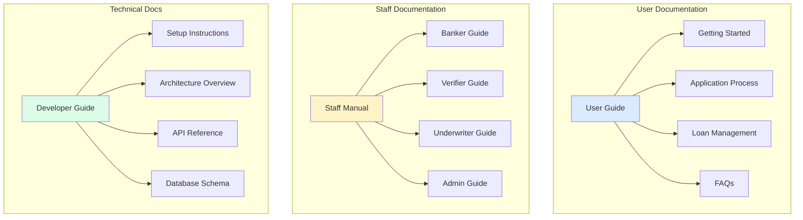

### Sample User Guide Content

#### Getting Started
1. **Registration**: Create your account with email verification
2. **Profile Setup**: Complete your personal and financial information
3. **First Application**: Step-by-step guide to submitting your first loan

#### Application Tracking
| Status | What it Means | Expected Duration |
|--------|---------------|-------------------|
| Submitted | Application received | - |
| Under Review | Banker reviewing | 1-2 business days |
| Verification | Documents being verified | 2-3 business days |
| Risk Assessment | Credit evaluation | 1-2 business days |
| Offer Generated | Loan offer ready | Review within 7 days |

### Cross-functional Contributions

| Collaborated With | Documentation Contribution |
|-------------------|---------------------------|
| Quoc Anh | UI screenshots, user flow diagrams |
| Tri | Staff interface walkthroughs |
| Frontend Team | Error message documentation |
| Backend Team | Status explanations |

### SCRIPT - Vo Quang Khai:
> "I'm Khai, one of the report writers. My focus was on end-user documentation and guides.
>
> Good software needs good documentation. Users shouldn't need to guess how to use the system. I created comprehensive guides for both applicants and staff members.
>
> For user documentation, I worked closely with Quoc Anh. He would show me the interface, I would use it as a real user would, and document any confusion points. This feedback loop actually led to several UI improvements - areas where users might get stuck.
>
> For staff documentation, I sat with Tri to understand each role's workflow. The banker guide explains how to evaluate applications, the verifier guide covers document checking procedures, and so on.
>
> I also contributed to testing. By following my own documentation, I became an unofficial QA tester. When something didn't work as documented, I reported it to the development team. Nam tracked these as test cases.
>
> Bao helped me understand the financial calculations so I could explain them in plain language. Users see 'Monthly Payment: $500' but my documentation explains how that number is calculated.
>
> Now Tuan will present the technical documentation."

---

# SLIDE 11: DOCUMENTATION - TECHNICAL DOCS

## Technical Documentation & API Reference

**Presented by: Tran Chau Thanh Tuan (Report Writer)**

### API Documentation Structure

```yaml
# OpenAPI 3.0 Specification Example
openapi: 3.0.0
info:
  title: OLAVS API
  version: 1.0.0
  description: Online Loan Application & Verification System API

paths:
  /api/applications:
    post:
      summary: Submit new loan application
      tags: [Applications]
      security:
        - bearerAuth: []
      requestBody:
        required: true
        content:
          application/json:
            schema:
              $ref: '#/components/schemas/ApplicationRequest'
      responses:
        '201':
          description: Application created successfully
          content:
            application/json:
              schema:
                $ref: '#/components/schemas/Application'
        '400':
          description: Validation error
        '401':
          description: Unauthorized
```

### Technical Documentation Map

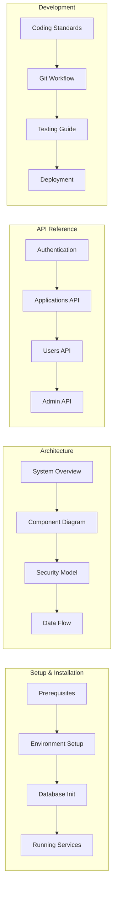

### API Response Standards

```typescript
// Standardized API Response Format
interface ApiResponse<T> {
  success: boolean;
  data?: T;
  error?: {
    code: string;
    message: string;
    details?: Record<string, string[]>;
  };
  meta?: {
    page?: number;
    limit?: number;
    total?: number;
    timestamp: string;
  };
}

// Example Success Response
{
  "success": true,
  "data": {
    "id": 1,
    "applicationNumber": "APP-2025-00001",
    "status": "SUBMITTED",
    "requestedAmount": 10000.00
  },
  "meta": {
    "timestamp": "2025-01-15T10:30:00Z"
  }
}
```

### SCRIPT - Tran Chau Thanh Tuan:
> "I'm Tuan, and I focused on technical documentation and API reference.
>
> While Khai wrote for end-users, I wrote for developers. My documentation enables future team members to understand and extend the system.
>
> The API reference was created in collaboration with Nhan and Khoi. After they implemented each endpoint, I documented it with request/response examples, error codes, and usage notes. I used OpenAPI specification so the documentation can be imported into tools like Postman.
>
> I also standardized our response format. Every API returns the same structure - success flag, data payload, and metadata. Hoai implemented this standard on the frontend, knowing exactly what to expect from every API call.
>
> The setup documentation was tested by having a fresh developer follow my instructions. When they got stuck, I updated the docs. This ensured anyone can set up the development environment from scratch.
>
> I worked with Danh on the architecture documentation. His system design decisions needed to be captured for posterity - why we chose certain technologies, what trade-offs we made.
>
> Now Nam will cover our testing and deployment documentation."

---

# SLIDE 12: DOCUMENTATION - TESTING & DEPLOYMENT

## Testing Strategy & Deployment Guide

**Presented by: Hoang Trieu Nam (Report Writer)**

### Testing Pyramid

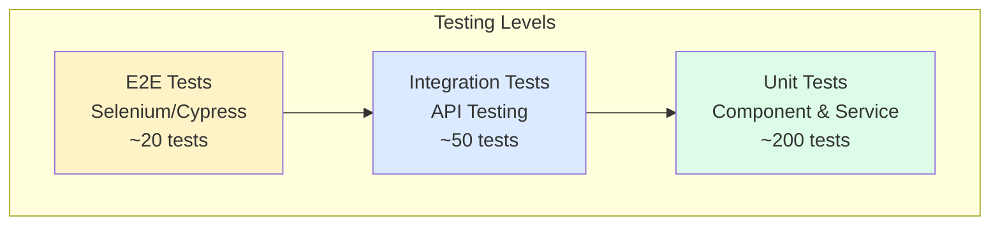

### Test Coverage Report

| Module | Coverage | Tests | Status |
|--------|----------|-------|--------|
| Auth Service | 95% | 45 | Passing |
| Application Service | 88% | 62 | Passing |
| Verification Service | 82% | 38 | Passing |
| Offer Service | 90% | 41 | Passing |
| Frontend Components | 75% | 120 | Passing |
| **Overall** | **85%** | **306** | **Passing** |

### Deployment Pipeline

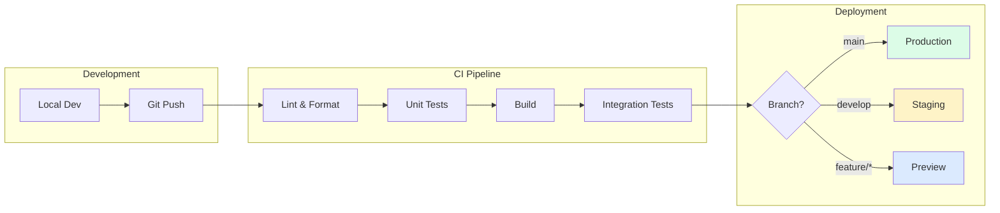

### Deployment Checklist

```markdown
## Pre-Deployment Checklist

### Code Quality
- [ ] All tests passing
- [ ] Code review approved
- [ ] No security vulnerabilities
- [ ] Performance benchmarks met

### Database
- [ ] Migrations tested on staging
- [ ] Backup completed
- [ ] Rollback script ready

### Configuration
- [ ] Environment variables set
- [ ] API keys rotated
- [ ] SSL certificates valid

### Post-Deployment
- [ ] Health checks passing
- [ ] Monitoring alerts configured
- [ ] User acceptance testing complete
```

### SCRIPT - Hoang Trieu Nam:
> "I'm Nam, and I documented our testing strategy and deployment processes.
>
> Quality assurance was a team effort. I coordinated test documentation while developers wrote the actual tests. Our testing pyramid shows the distribution - many unit tests, fewer integration tests, and focused end-to-end tests.
>
> I tracked test coverage using reports from the CI pipeline. When coverage dropped, I flagged it to the team. When Khoi added new features, I reminded him to add tests. This accountability helped us maintain 85% overall coverage.
>
> The deployment documentation ensures consistent, repeatable deployments. I observed Danh deploying to staging and documented each step. This playbook means any team member can deploy safely.
>
> I also maintained the bug tracking database. When Khai found issues during his user testing, I logged them with reproduction steps. When they were fixed, I verified and closed them.
>
> My work connected with everyone. I tested Quoc Anh and Tri's interfaces. I verified Nhan and Khoi's APIs. I validated Khanh and Bao's database migrations. And I helped Khai and Tuan ensure their documentation was accurate.
>
> Now, let me pass back to our leader, Danh, for the conclusion."

---

# SLIDE 13: CLOSING & TEAM COLLABORATION

## Team Collaboration & Project Success

**Presented by: Le Thanh Danh (Team Leader)**

### Collaboration Matrix

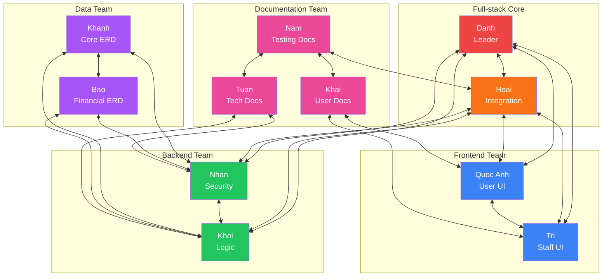

### Key Achievements

| Metric | Value |
|--------|-------|
| Total Commits | 500+ |
| Code Reviews | 150+ |
| Features Delivered | 25 |
| API Endpoints | 45 |
| Test Coverage | 85% |
| Documentation Pages | 30+ |

### Project Timeline

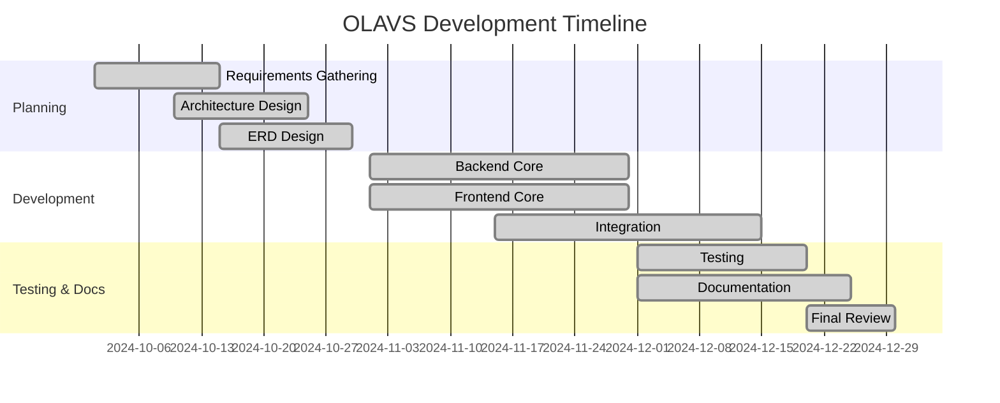

### Lessons Learned

1. **Communication is Key**: Daily standups and clear documentation prevented misunderstandings
2. **Cross-functional Skills**: Everyone contributed beyond their primary role
3. **Iterative Development**: Regular demos caught issues early
4. **Documentation-First**: Specs before code reduced rework

### SCRIPT - Le Thanh Danh (Closing):
> "As we conclude, I want to emphasize that OLAVS is truly a team effort. This collaboration matrix shows how interconnected our work was.
>
> Every feature you saw today passed through multiple team members. A single loan application touches:
> - Quoc Anh's form components
> - Hoai's API integration
> - Nhan's authentication
> - Khoi's business logic
> - Khanh and Bao's data model
> - And our report writers' documentation
>
> We learned that the best software comes from collaboration, not isolation. When Khanh updated the schema, Nhan updated the entities, Khoi updated the services, Hoai updated the API calls, and Quoc Anh updated the forms. This chain only worked because we communicated constantly.
>
> Our documentation team was invaluable. They weren't just writing reports - they were testing, validating, and improving the system. Khai's user testing found real bugs. Tuan's API documentation became our development contract. Nam's test tracking kept us honest about quality.
>
> Thank you for your attention. We're proud of what we've built together, and we're happy to answer any questions.
>
> OLAVS - Built by a team, for users who deserve a better loan experience."

---

## Appendix: Presentation Notes

### Timing Guide (20 minutes total)

| Slide | Duration | Presenter |
|-------|----------|-----------|
| 1 - Opening | 1 min | Danh |
| 2 - Architecture | 1.5 min | Danh |
| 3 - Integration | 1.5 min | Hoai |
| 4 - User UX | 2 min | Quoc Anh |
| 5 - Staff UI | 2 min | Tri |
| 6 - Use Cases | 1.5 min | Nhan |
| 7 - Data Flow | 1.5 min | Khoi |
| 8 - Core ERD | 1.5 min | Khanh |
| 9 - Extended ERD | 1.5 min | Bao |
| 10 - User Docs | 1.5 min | Khai |
| 11 - Tech Docs | 1.5 min | Tuan |
| 12 - Testing | 1.5 min | Nam |
| 13 - Closing | 1.5 min | Danh |
| **Total** | **20 min** | - |

### Equipment Checklist
- [ ] Laptop with presentation
- [ ] HDMI/USB-C adapter
- [ ] Backup on USB drive
- [ ] Video files tested
- [ ] Clicker/remote
- [ ] Backup presenter notes printed

### Video Requirements Summary
1. **User Journey Video** (Slide 4)
   - Duration: 1-1.5 minutes (condensed)
   - Resolution: 1920x1080
   - Content: Key user application highlights

2. **Staff Workflow Video** (Slide 5)
   - Duration: 1-1.5 minutes (condensed)
   - Resolution: 1920x1080
   - Content: Key staff role highlights
