# OLAVS - Team Presentation Slides

---

## Slide 1: Opening

### OLAVS - Online Loan Application & Verification System

**A Comprehensive Digital Loan Management Platform**

**Team PDM Project**

- 11 Members | 5 Roles | 1 Vision

**Presenter: Le Thanh Danh (Team Leader)**

---

## Slide 2: System Architecture

### Technology Stack

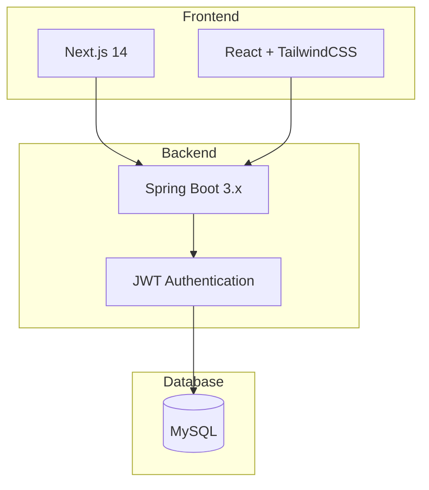

| Layer | Technology |
|-------|------------|
| Frontend | Next.js 14, React, TailwindCSS |
| Backend | Spring Boot 3.x, Java 17 |
| Database | MySQL |
| Auth | JWT + HttpOnly Cookies |

**Presenter: Le Thanh Danh**

---

## Slide 3: Full-stack Integration

### API Client Architecture

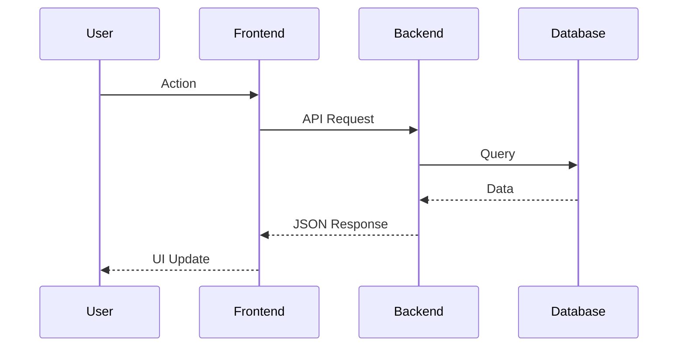

### Key Points

- Centralized API client for consistent error handling
- HttpOnly cookies for secure authentication
- Standardized JSON response format
- Real-time UI updates with optimistic rendering

Presenter: Dao Huu Hoai

---

## Slide 4: User Experience Flow

### User Journey

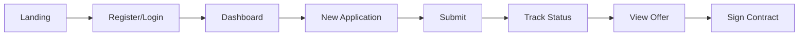

### Key Points

- Multi-step application wizard with validation
- Real-time status tracking with timeline
- Document upload with progress indicator
- Mobile-responsive design

[VIDEO: User Journey Demo - 1 min]

Presenter: Le Hoang Quoc Anh

---

## Slide 5: Staff Interface

### Role-Based Dashboards

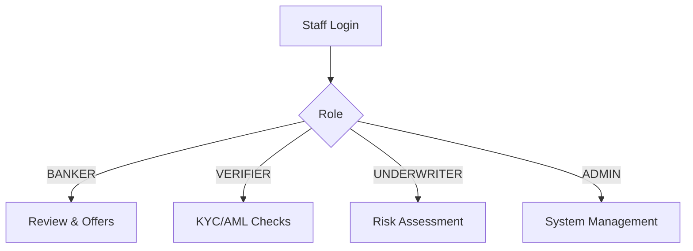

### Key Points

- 4 distinct role-based dashboards
- Shared component library with User UI
- Application queue with filtering/sorting
- One-click status transitions

[VIDEO: Staff Workflow Demo - 1 min]

Presenter: Truong Minh Tri

---

## Slide 6: Backend Use Cases

### System Actors & Actions

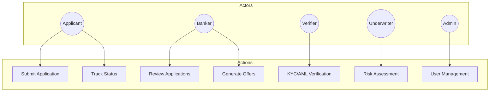

### Key Points

5 actor types with distinct permissions
JWT + HttpOnly cookies (XSS prevention)
Role-based access control (RBAC)
45 REST API endpoints

Presenter: Vu Duc Nhan

---

## Slide 7: Application Lifecycle

### State Machine

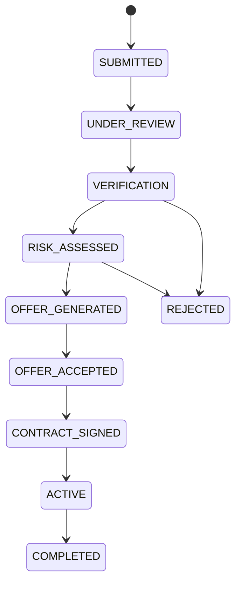

### Key Points

11 application states with validated transitions
Business rules enforced at each step
Automatic notifications on state change
Caching for frequently accessed data

Presenter: Vo Tri Khoi

---

## Slide 8: Core ERD

### Main Entities

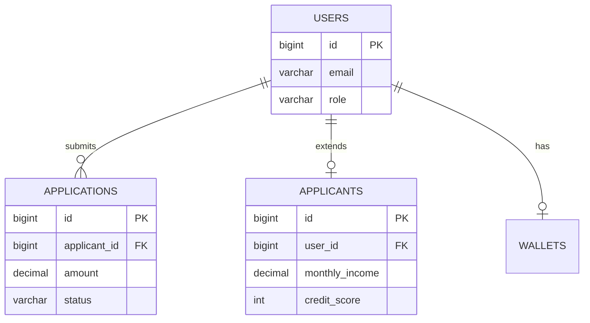

### Core Queries

```sql
-- Get user with applicant profile
SELECT u.*, a.monthly_income, a.credit_score
FROM users u
JOIN applicants a ON u.id = a.user_id
WHERE u.id = ?;

-- Get user's applications with status
SELECT * FROM applications
WHERE applicant_id = ?
ORDER BY created_at DESC;
```

Presenter: Phan Minh Khanh

---

## Slide 9: Financial ERD

### Verification & Payment Flow

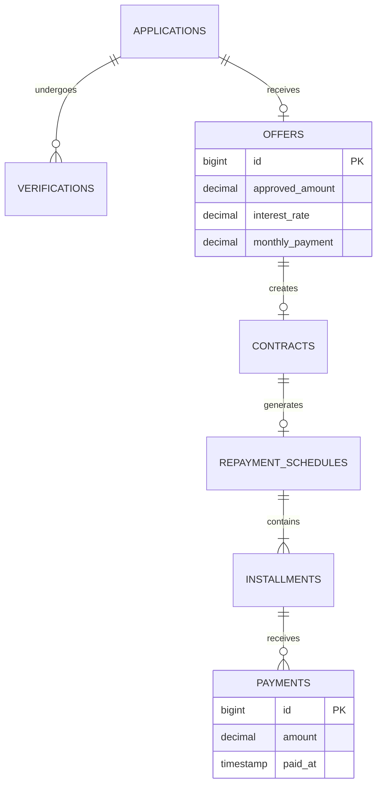

### Financial Queries

```sql
-- EMI Calculation (Equated Monthly Installment)
-- Formula: P × r × (1+r)^n / ((1+r)^n - 1)
SELECT
    approved_amount AS principal,
    interest_rate / 12 / 100 AS monthly_rate,
    term_months,
    ROUND(approved_amount * (interest_rate/12/100) *
        POW(1 + interest_rate/12/100, term_months) /
        (POW(1 + interest_rate/12/100, term_months) - 1), 2
    ) AS monthly_payment
FROM offers WHERE id = ?;

-- Get loan payment status
SELECT i.installment_number, i.due_date, i.amount,
       COALESCE(SUM(p.amount), 0) AS paid,
       CASE WHEN COALESCE(SUM(p.amount),0) >= i.amount
            THEN 'PAID' ELSE 'PENDING' END AS status
FROM installments i
LEFT JOIN payments p ON i.id = p.installment_id
WHERE i.schedule_id = ?
GROUP BY i.id;
```

Presenter: Vo Nguyen Dinh Bao

---

## Slide 10: User Documentation

### Documentation Structure

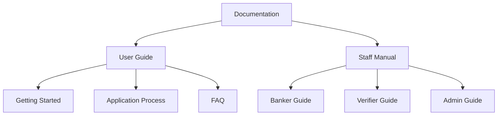

### Key Points

- Step-by-step guides for applicants
- Role-specific staff manuals
- FAQ from real user testing
- Status explanation tables

Presenter: Vo Quang Khai

---

## Slide 11: Technical Documentation

### API & Developer Docs

```yaml
openapi: 3.0.0
paths:
  /api/applications:
    post:
      summary: Submit application
      security: [bearerAuth]
      responses:
        201: Created
        400: Validation Error
        401: Unauthorized
```

| Document | Purpose |
|----------|---------|
| API Reference | Endpoint documentation |
| Setup Guide | Development environment |
| Architecture | System design decisions |

### Key Points

- OpenAPI 3.0 specification
- Standardized response format
- Tested setup instructions
- Architecture decision records

Presenter: Tran Chau Thanh Tuan

---

## Slide 12: Testing & Deployment

### Testing Pyramid

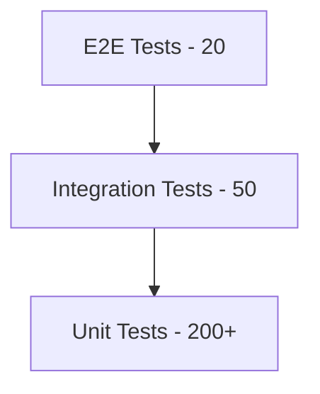

| Metric | Value |
|--------|-------|
| Unit Tests | 200+ |
| Integration Tests | 50 |
| E2E Tests | 20 |
| Coverage | 85% |

### Key Points

- 85% test coverage maintained
- CI/CD pipeline with automated testing
- Deployment playbook documentation
- Bug tracking with reproduction steps

Presenter: Hoang Trieu Nam

---

## Slide 13: Team Collaboration & Closing

### Cross-functional Collaboration

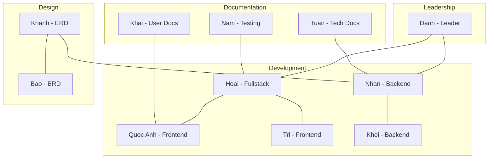

### Key Achievements

| Metric | Value |
|--------|-------|
| Features | 25 |
| API Endpoints | 45 |
| Test Coverage | 85% |
| Documentation | 30+ pages |

**OLAVS - Built by a team, for users who deserve a better loan experience.**

**Presenter: Le Thanh Danh**

---

## Timing Guide (20 min total)

| Slide | Duration | Presenter |
|-------|----------|-----------|
| 1 - Opening | 1 min | Danh |
| 2 - Architecture | 1.5 min | Danh |
| 3 - Integration | 1.5 min | Hoai |
| 4 - User UX | 2 min | Quoc Anh |
| 5 - Staff UI | 2 min | Tri |
| 6 - Use Cases | 1.5 min | Nhan |
| 7 - Data Flow | 1.5 min | Khoi |
| 8 - Core ERD | 1.5 min | Khanh |
| 9 - Financial ERD | 1.5 min | Bao |
| 10 - User Docs | 1.5 min | Khai |
| 11 - Tech Docs | 1.5 min | Tuan |
| 12 - Testing | 1.5 min | Nam |
| 13 - Closing | 1.5 min | Danh |
