# PDM Remediation Task Dependency DAG

This document contains visual representations of task dependencies using Mermaid diagrams.

---

## Complete Project DAG

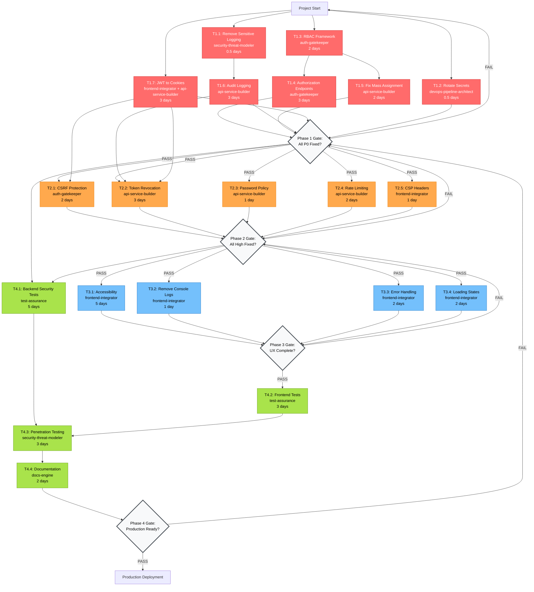

---

## Critical Path (Longest Duration)

```mermaid
graph LR
    START[Start] --> T1.3[T1.3: RBAC Framework<br/>2 days]
    T1.3 --> T1.4[T1.4: Authorization Endpoints<br/>3 days]
    T1.4 --> T2.1[T2.1: CSRF Protection<br/>2 days]
    T2.1 --> T2.2[T2.2: Token Revocation<br/>3 days]
    T2.2 --> T3.1[T3.1: Accessibility<br/>5 days]
    T3.1 --> T4.1[T4.1: Backend Tests<br/>5 days]
    T4.1 --> T4.3[T4.3: Pen Testing<br/>3 days]
    T4.3 --> T4.4[T4.4: Documentation<br/>2 days]
    T4.4 --> END[Production]

    classDef critical fill:#ff6b6b,stroke:#c92a2a,color:#fff
    class T1.3,T1.4,T2.1,T2.2,T3.1,T4.1,T4.3,T4.4 critical
```

**Critical Path Duration:** 25 days (5 weeks)
**Total Project Duration:** 40 days (8 weeks with parallel work)

---

## Phase 1: Critical Security Dependencies

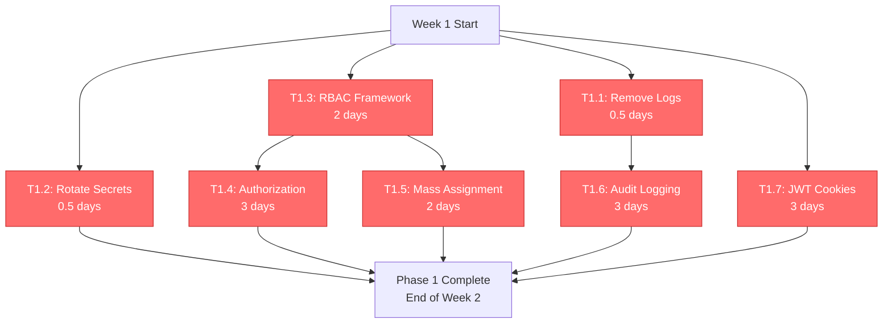

---

## Phase 2: High-Priority Security Dependencies

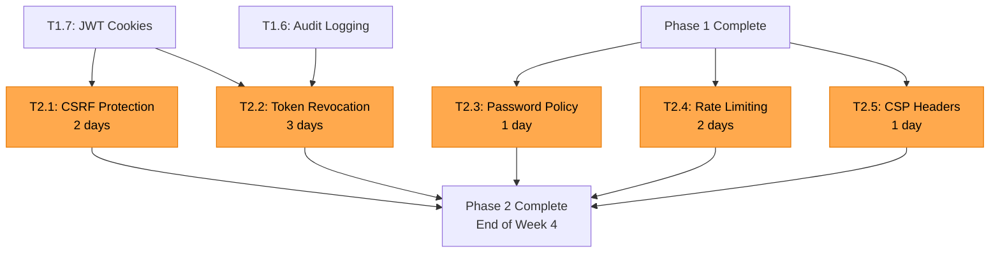

---

## Agent Workload Timeline

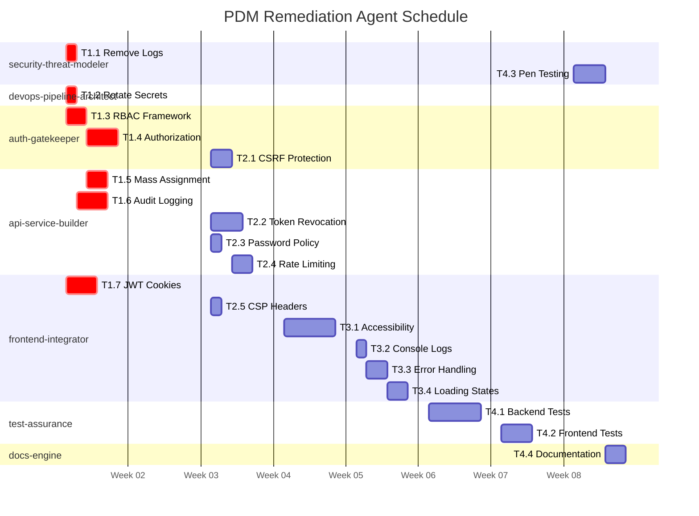

---

## Parallel Execution Opportunities

### Week 1 (3 parallel streams)

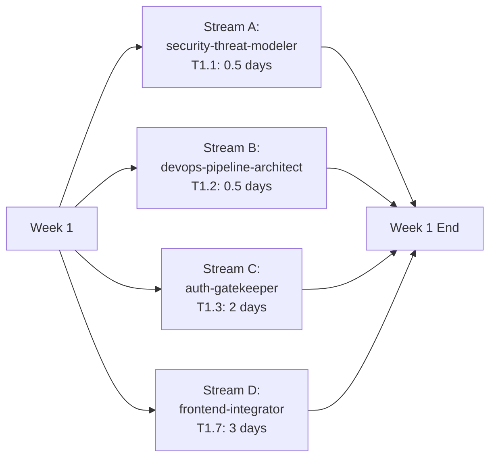

### Week 2 (2 parallel streams)

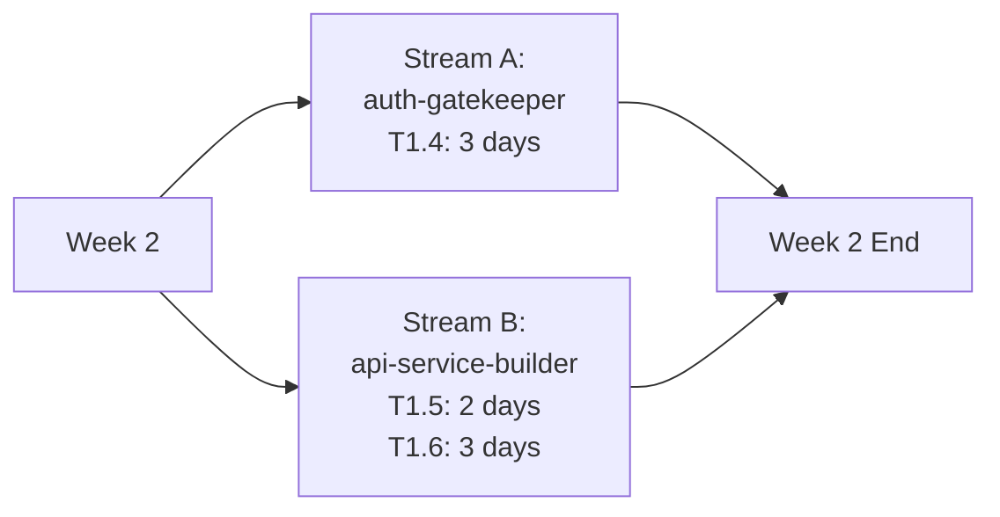

### Week 3-4 (3 parallel streams)

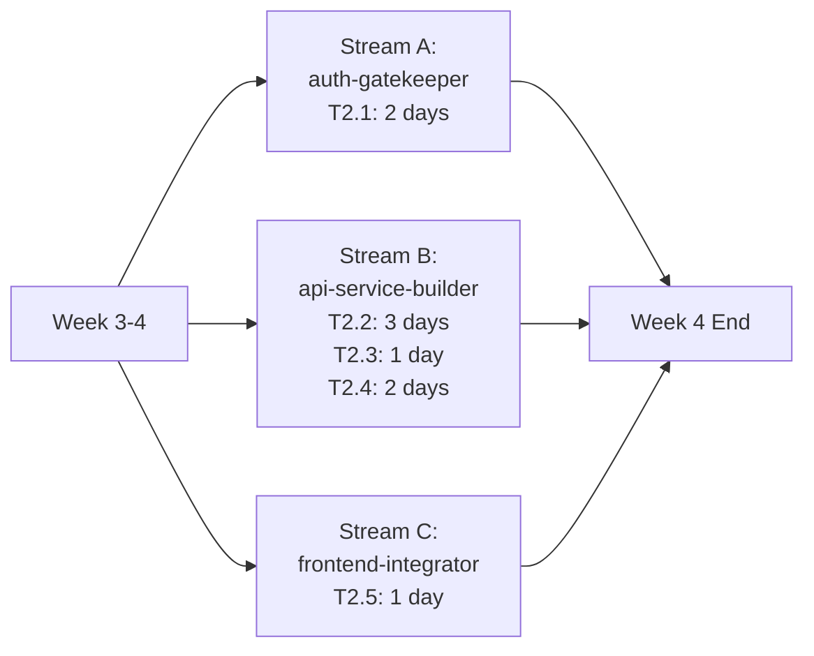

### Week 5-6 (All frontend-integrator)

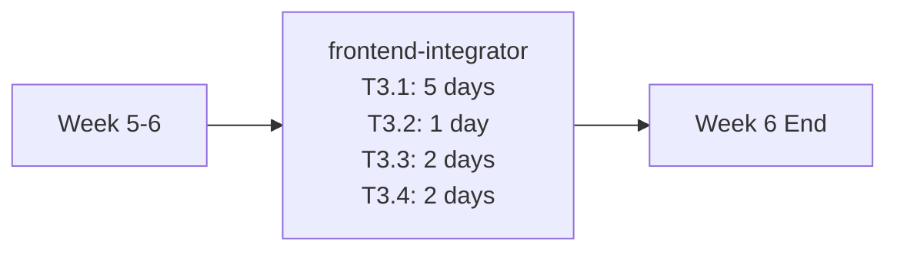

### Week 7-8 (Test phase)

---

## Quality Gate Dependencies

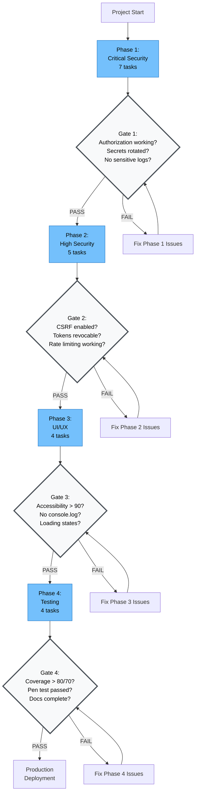

---

## Task Complexity Heat Map

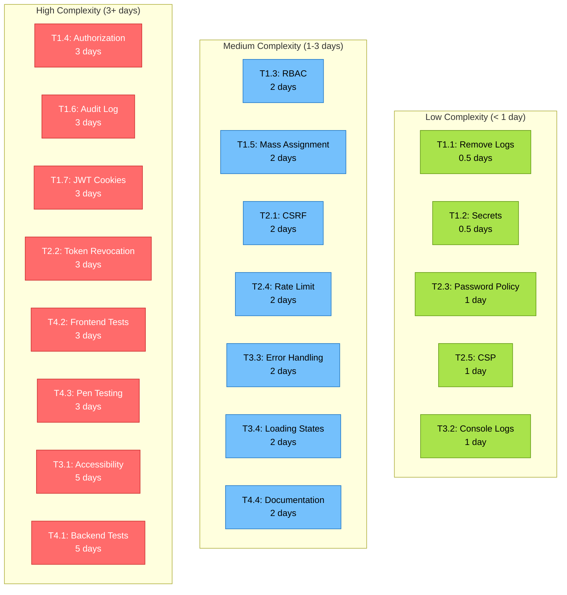

---

## How to Use These Diagrams

1. **Complete Project DAG:** Shows all task dependencies and quality gates
2. **Critical Path:** Identifies longest sequence of dependent tasks (25 days)
3. **Phase Diagrams:** Detailed view of dependencies within each phase
4. **Gantt Chart:** Timeline view showing agent workload distribution
5. **Parallel Execution:** Opportunities to run tasks simultaneously
6. **Quality Gates:** Decision points for proceeding to next phase
7. **Heat Map:** Visual guide to task complexity for resource planning

---

## Legend

- **Red (Critical):** Phase 1 tasks - must fix before production
- **Orange (High):** Phase 2 tasks - high-severity security issues
- **Blue (Medium):** Phase 3 tasks - UI/UX improvements
- **Green (Test):** Phase 4 tasks - testing and documentation
- **Gray (Gate):** Quality gates - must pass to proceed

---

**Note:** All diagrams can be rendered using Mermaid in GitHub, GitLab, or any Mermaid-compatible viewer.

To view these diagrams:
1. View this file on GitHub (native Mermaid rendering)
2. Use Mermaid Live Editor: https://mermaid.live/
3. Use VS Code with Mermaid extension
4. Export to PNG/SVG using Mermaid CLI
